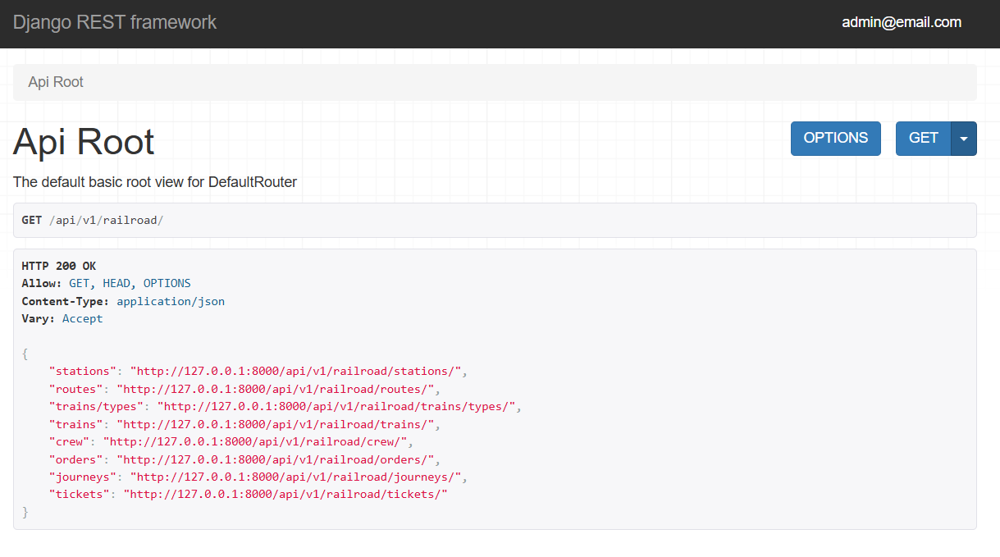
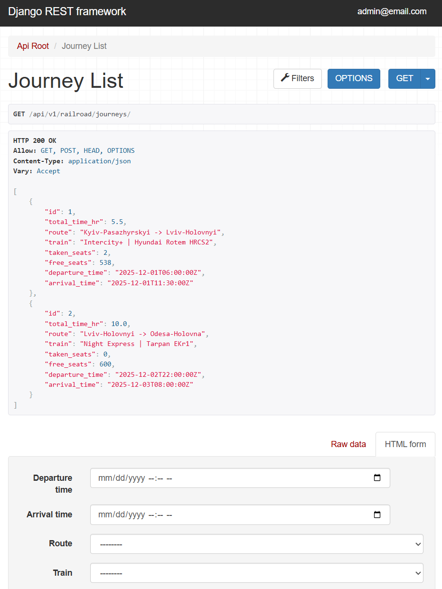
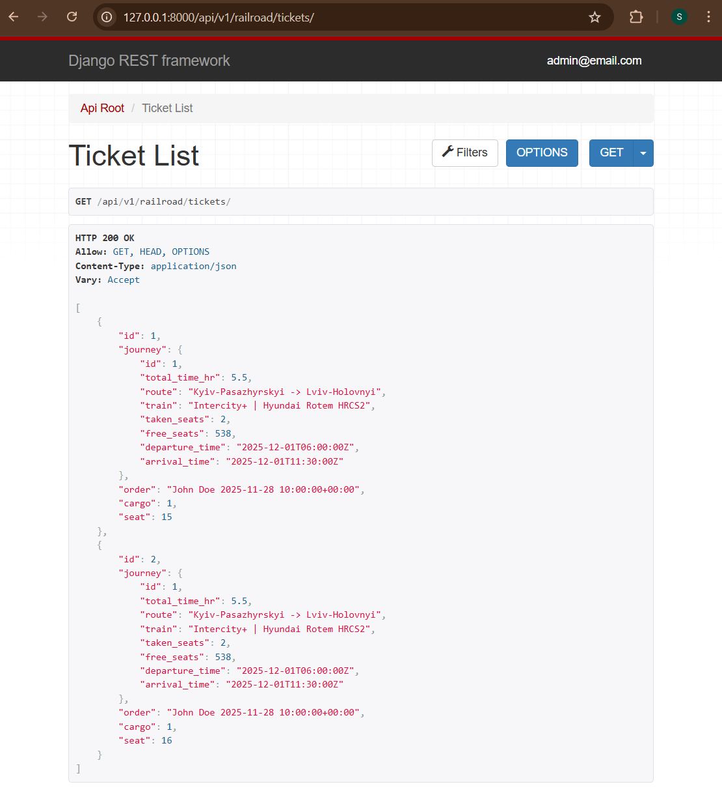

# TrainStationApi
### API service for railroad management written on DRF

## Features
* JWT authentication
* Extensive validation
* Browsable documentation
* Filtering results
* Limit-Offset pagination

## Install using GitHub
```bash
  git clone https://github.com/Solyariy/TrainStationApi.git 
```
## Configure .env file
```dotenv
POSTGRES_PASSWORD=
POSTGRES_USER=
POSTGRES_DB=
POSTGRES_HOST=db
POSTGRES_PORT=5432
PGDATA=/var/lib/postgresql/data
```
## Build the docker image
##### Migrations are made automatically in docker
```bash
  docker-compose build
```
## Run the docker container
##### Docker should be installed
```bash
  docker-compose run
```
## Create superuser
```
docker exec -it <server_container_id> python manage.py createsuperuser
```
###### May use this code to get container id
```bash
  docker ps
```
###### May use this code to populate db with test data
```bash
  docker exec -it <server_container_id> python manage.py loaddata test_data.json
```
## Get access
* Create user: /api/v1/user/register/
* Get access token: /api/v1/user/token/
###### Use email and password in body
## Documentation
* Get schema for postman: **/api/v1/schema/**
* Use swagger-ui: **/api/v1/schema/swagger-ui/**
* Use redoc: **/api/v1/schema/redoc/**

## DB models diagram


## Examples of browsable API


